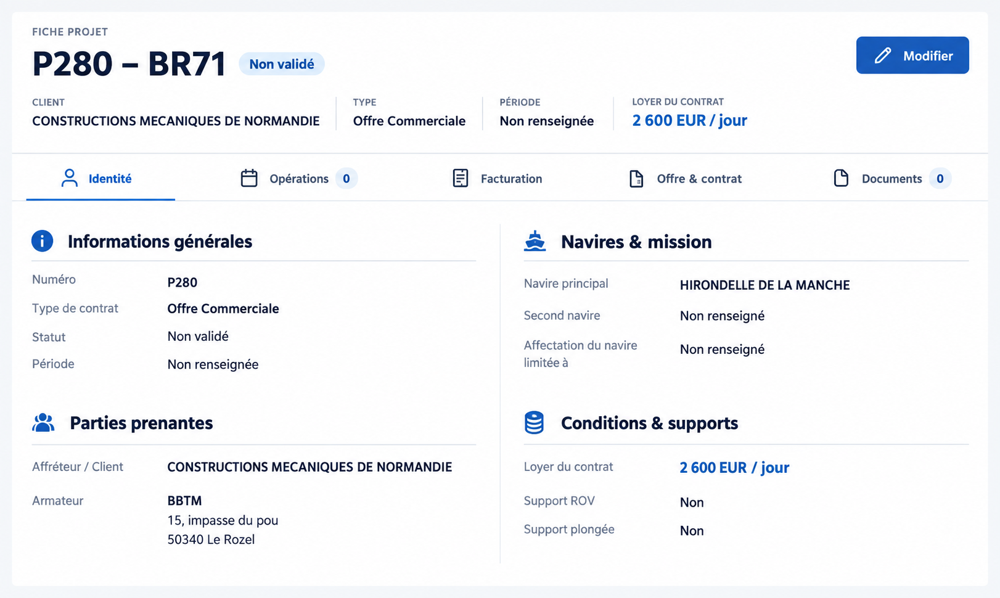
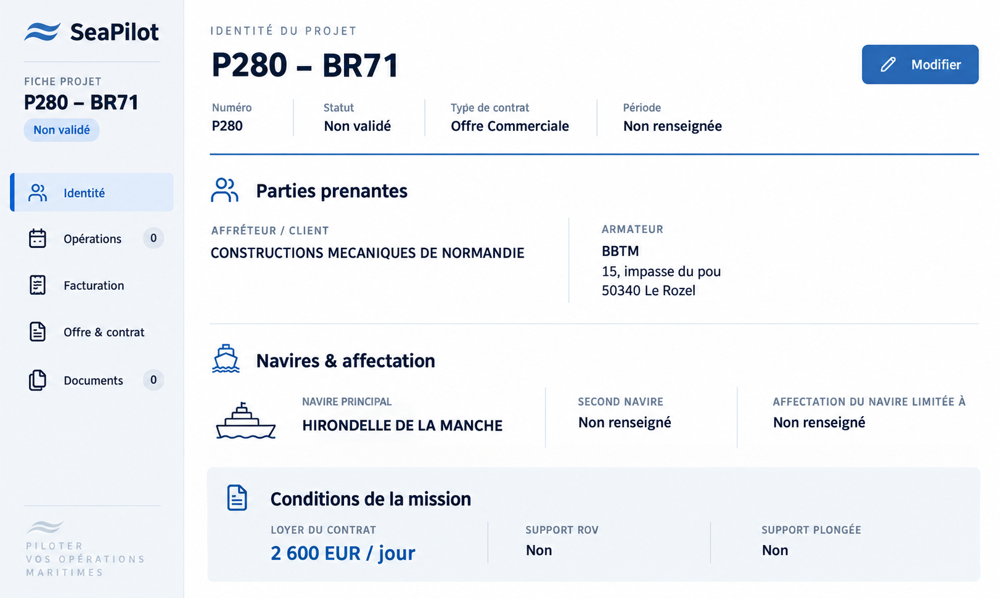
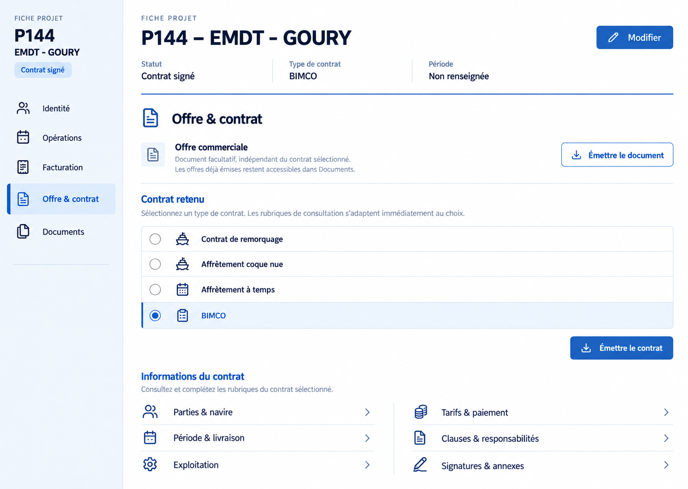
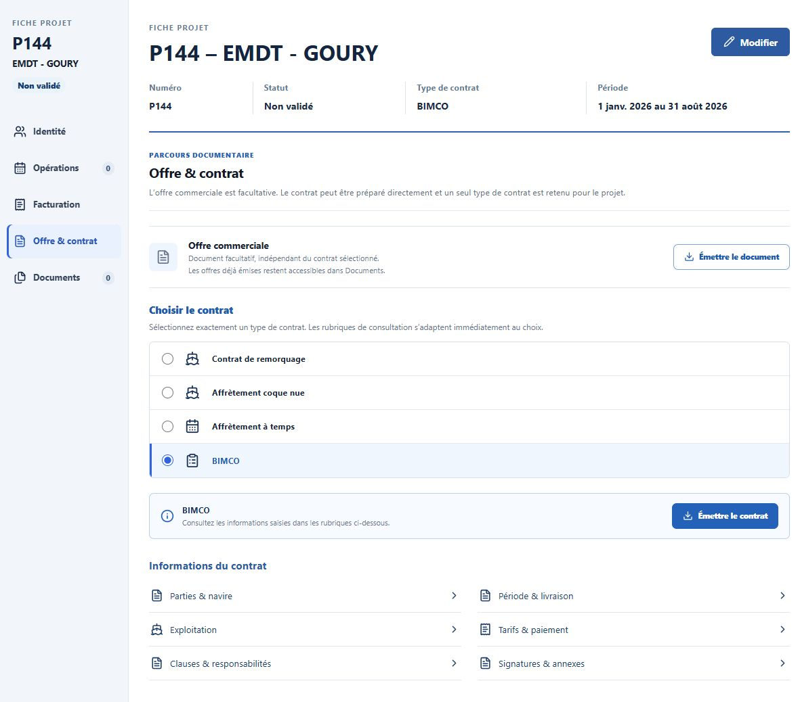

# Fiche Projet — propositions du 25 septembre 2026

Le bouton « Densité » est retiré du ruban Projets. La présentation compacte,
déjà utilisée par défaut, devient fixe. Aucun changement de données, de droits
d'accès, de configuration ou de migration n'est nécessaire.

Les deux maquettes ci-dessous ont été générées avec ImageGen à partir de la
capture fournie. La proposition 2 a été retenue et intégrée dans la préversion.
La proposition 1 reste ici pour documenter le choix initial.

## Proposition 1 — Fiche éditoriale

Navigation horizontale, informations en deux colonnes et groupes séparés par
des filets fins : informations générales, parties prenantes, navires et mission,
conditions et supports.

## Proposition 2 — Dossier maritime

Navigation latérale, identité en tête de fiche, présentation successive des
parties prenantes et des navires, puis bandeau des conditions de la mission.

## Contraintes communes

- Conserver Identité, Opérations, Facturation, Offre & contrat et Documents.
- Conserver toutes les données visibles dans la capture du projet P280 – BR71,
  y compris les champs non renseignés et les compteurs à zéro.
- Garder le bouton Modifier et les couleurs de SeaPilot.
- Remplacer l'empilement des cases grises par une fiche hiérarchisée et lisible.
- Ne pas réintroduire le contrôle de densité.

Les éléments de marque suggérés par la génération restent illustratifs ;
l'intégration réutilise les composants et ressources existants de SeaPilot.

## Préversion retenue et P144

La navigation principale conserve cinq sections. Les rubriques propres au type
de contrat sont accessibles depuis « Offre & contrat », au centre de la fiche.
Pour BIMCO, les regroupements par numéros de cases sont remplacés par :

- Parties & navire
- Période & livraison
- Exploitation
- Tarifs & paiement
- Clauses & responsabilités
- Signatures & annexes

Cette organisation s'applique aussi à l'éditeur et à sa liste de complétude.
Les 34 cases P144, les deux signatures et les annexes conservent leurs clés de
stockage et leurs positions dans le document généré. Les valeurs P144 explicites
priment dans la consultation ; les champs historiques sans équivalent restent
visibles avec la mention « historique ». Les anciens contrats SUPPLYTIME sont
également consultables selon ces six thèmes. Aucune migration n'est nécessaire.

Le mode de démonstration contient P280 (données de la capture) et P144 avec des
conditions fictives et signalées comme telles. Il ne valide pas le contenu du
contrat réel P144. Les essais vérifient la restitution des données enregistrées,
les valeurs multilignes, les valeurs à zéro et les contrats mêlant ancien et
nouveau format.

Sur écran étroit, le portefeuille passe au-dessus de la fiche ; sur mobile, les
sections deviennent une navigation horizontale et les données une seule colonne.
Voir [le contrôle visuel et fonctionnel](../../design-qa.md).
